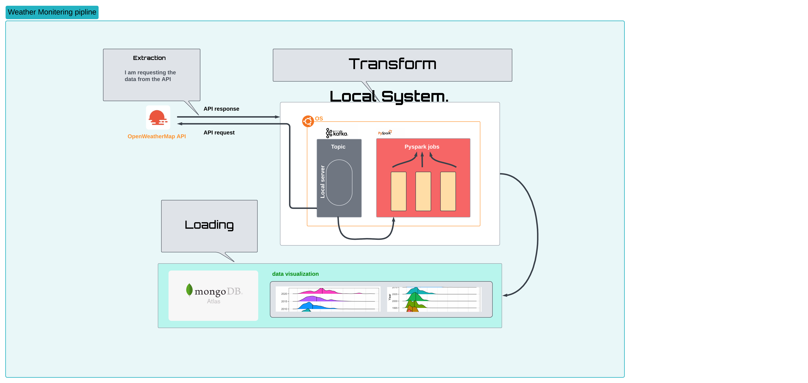

# 💎 This Project is to Demonstrate the Knowledge in  `Data Engineering Domain`.
>▮  This is a live weather Data Monitoring End_to_End Pipeline Project. 🦉

# 🌐 Socials :
   

# 💻 Technoliges I have use in this project :
  
   

# 🗿 Flow Chart :

# 🧩 Project Flow :

>Install Kafka and Spark !

>Create the account in the OpenWeatherMap Api.

>Watchout for the Dependencies Needed.

>Run your  `ZooKeeper Server` in your Local System.

                        $ bin/zookeeper-server-start.sh config/zookeeper.properties

>Start your `kafka Server` in your Local System.

                        $ bin/kafka-server-start.sh config/server.properties

>If you haven't created `topic` the create one

                        $ bin/kafka-topics.sh --create --topic <Topic_name> --bootstrap-server localhost:9092

>Open up the `producer` in other terminal or run the producer code  `Api_To_Kafka.py`  or  `Api_To_Kafka_With_Pyspark.py`

                        $ bin/kafka-console-producer.sh --broker-list localhost:9092 --topic <Topic_name>

>Now run the `Consumer Ap`p which will consume the data from that Topic or run the consumer code  `Kafka_To_Parquet.py` and `Parquet_To_MongoDB.py`

                        $ bin/kafka-console-consumer.sh --bootstrap-server localhost:9092 --topic <Topic_name> --from-beginning
>In this project, I have used MongoDB Atlas to store and view real-time data. 
>To integrate MongoDB with the locally running Spark job, you need to download the [`Spark-MongoDB Connector.`](https://www.mongodb.com/docs/spark-connector/current/).
>It is a JAR file that you can find in the provided link or on the [`Maven Dependencies`](https://mvnrepository.com/artifact/org.mongodb.spark/mongo-spark-connector) webpage.

# 🎰 Language Type :

========================================================================================================================================================================================================
